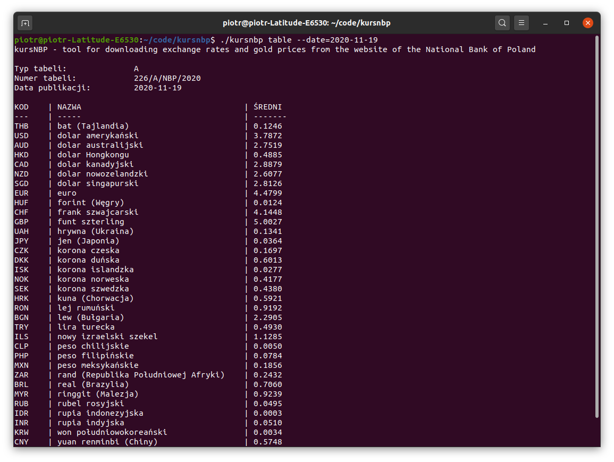
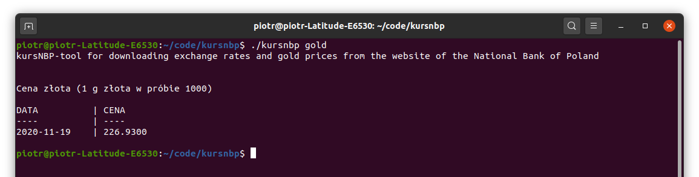
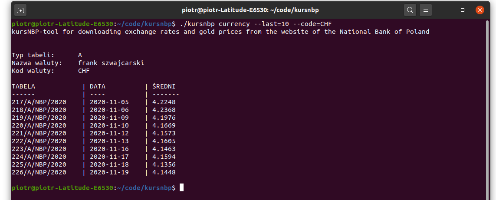

# kursNBP

**[Opis](#opis)** 
**[Description](#description)** 
**[Screenshots](#screenshots)** 
**[Contact](#contact)** 

## Opis:

kursNBP - konsolowy program do pobierania kursów walut i notowań cen złota z serwisu Narodowego Banku Polskiego

Do pobrania:  
[linux](https://github.com/pjaskulski/kursnbp/releases/download/v0.2/kursnbp_v0.2_linux.tar.gz) 
[windows](https://github.com/pjaskulski/kursnbp/releases/download/v0.2/kursnbp_v0.2_windows.zip) 
[macos](https://github.com/pjaskulski/kursnbp/releases/download/v0.2/kursnbp_v0.2_macos.tar.gz) 

    Użycie:
      kursnbp table|currency|gold [--flag]

    Polecenia: 
      table      Zwraca tabelę kursów wymiany walut (lub serię tabel)
      currency   Zwraca kurs wskazanej waluty lub serię kursów
      gold       Zwraca cenę złota lub serię notowań cen złota (cena 1 g złota, 
                 w próbie 1000)

    Flagi globalne: 
         --version   Wyświetla wersję programu
      -h --help      Wyświetla pomoc z opisem poleceń i flag programu
      -o --output    Format danych wyjściowych: table (sformatowana tabela 
                     tekstowa), json (format json), csv (dane z polami 
                     rozdzielanymi przecinkiem, nazwy pól w pierwszym wierszu),
                     domyślnie: table 
  
    Flagi dla poleceń:
      table: 
        -t --table   Typ tabeli kursów: A, B lub C, domyślnie: A
        -d --date    Data tabeli kursów w formacie: 'RRRR-MM-DD', lub zakres 
                     dat 'RRRR-MM-DD:RRRR-MM-DD' lub 'today' (kurs na dziś) lub
                     'current' - bieżąca tabela/kurs (ostatnio opublikowany)
                     domyślnie: current
        -l --last    Alternatywnie do --date można pobrać ostatnich <n> 
                     tabel/kursów np. --last=5, domyślnie: 0
    
      currency:
        -t --table   Typ tabeli kursów: A, B lub C, domyślnie: A
        -d --date    Data tabeli kursów w formacie: 'RRRR-MM-DD', lub zakres 
                     dat 'RRRR-MM-DD:RRRR-MM-DD' lub 'today' (kurs na dziś) lub
                     'current' - bieżąca tabela/kurs (ostatnio opublikowany)
                     domyślnie: current
        -l --last    Alternatywnie do --date można pobrać ostatnich <n> 
                     tabel/kursów np. --last=5, domyślnie: 0
        -c --code    Kod waluty w standardzie ISO 4217, zależnie od typu tabeli 
                     lista dostępnych walut może się różnić

      gold:
        -d --date    Data notowania ceny złota w formacie: 'RRRR-MM-DD', lub 
                     zakres dat 'RRRR-MM-DD:RRRR-MM-DD' lub 'today' (cena na 
                     dziś) lub 'current' - bieżąca cena (ostatnio opublikowana)
                     domyślnie: current
        -l --last    Alternatywnie do --date można pobrać ostatnich <n> cen 
                     złota np. -l=5, domyślnie: 0

Przykłady:
    
    kursnbp table
    Wyświetla bieżącą tabelę kursów typu A
    
    kursnbp table --last=2 --table=C
    Wyświetla 2 ostatnie tabele kursów typu C

    kursnbp table --date=2020-11-19 --table=A
    Wyświetla tabelę kursów walut z podanego dnia

    kursnbp table --date=today --output=csv
    Wyświetla dzisiejszą tabelę kursów w formacie csv

    kursnbp currency --code=CHF
    Wyświetla bieżący kurs waluty CHF (frank szwajcarski)

    kursnbp currency --code=EUR --last=10
    Wyświetla 10 ostatnich kursów waluty EUR (euro)

    kursnbp gold
    Wyświetla bieżącą cenę złota

    kursnbp gold --date=2020-11-12:2020-11-19
    Wyświetla listę notowań cen złota w podanym przedziale dat

Dokumentacja serwisu API Narodowego Banku Polskiego: [http://api.nbp.pl/](http://api.nbp.pl/)

## Description:

kursNBP - a command line tool for downloading exchange rates and gold prices from the website of the National Bank of Poland

Downloads:  
[linux](https://github.com/pjaskulski/kursnbp/releases/download/v0.2/kursnbp_v0.2_linux.tar.gz) 
[windows](https://github.com/pjaskulski/kursnbp/releases/download/v0.2/kursnbp_v0.2_windows.zip) 
[macos](https://github.com/pjaskulski/kursnbp/releases/download/v0.2/kursnbp_v0.2_macos.tar.gz) 

    Usage:
      kursnbp table | currency | gold [--flag]

    Commands:
      table       returns a table of exchange rates (or a series of tables)
      currency    returns the rate of the specified currency or a series of 
                  rates
      gold        returns the price of gold (or series), the price of 1g of gold
                  (of 1000 millesimal fineness) calculated at NBP

    Global Flags:
         --version    Displays the version of the program
      -h --help       Displays help describing program commands and flags
      -o --output     Output format: table (formatted text table),
                      json (json format), csv (data with comma separated fields,
                      field names on the first line), default: table
  
    Flags for commands:
      table:
        -t --table    Table type: A, B or C, default: A
        -d --date     Date in the format: 'YYYY-MM-DD', or a range
                      dat 'YYYY-MM-DD:YYYY-MM-DD' or 'today' (rate for today) or
                      'current' - current table / rate (last published)
                      default: current
        -l --last     As an alternative to --date, the last <n> tables / rates 
                      can be retrieved e.g. --last = 5, default: 0
    
      currency:
        -t --table    Table type: A, B or C, default: A
        -d --date     Date in the format: 'YYYY-MM-DD', or a date
                      range 'YYYY-MM-DD:YYYY-MM-DD' or 'today' (rate for today) 
                      or 'current' - current table / rate (last published)
                      default: current
        -l --last     As an alternative to --date, the last <n> tables / rates 
                      can be retrieved e.g. --last = 5, default: 0
        -c --code     ISO 4217 currency code, depending on the type of the table 
                      available currencies may vary

      gold:
        -d --date    Date in the format: 'YYYY-MM-DD', or a date range
                     'YYYY-MM-DD: YYYY-MM-DD' or 'today' (today's price) or
                     'current' - current price (last published)
                     default: current
        -l --last    As an alternative to --date, the last <n> gold price can be
                     retrieved e.g. --last = 5, default: 0

Examples:
    
    kursnbp table
    Displays the current table of exchange rate of type A
    
    kursnbp table --last=2 --table=C
    Series of latest 2 tables of exchange rates of type C

    kursnbp table --date=2020-11-19 --table=A
    Exchange rate table of type A published on 19 November 2020

    kursnbp table --date=today --output=csv
    Exchange rate table of type A published today in csv format

    kursnbp currency --code=CHF
    Current exchange rate CHF (Swiss franc) from the exchange rate 
    table of type A

    kursnbp currency --code=EUR --last=10
    Series of latest 10 exchange rates of currency EUR (euro) 
    from the exchange rate table of type A

    kursnbp gold
    Current gold price

    kursnbp gold --date=2020-11-12:2020-11-19
    Series of gold prices published from 12 November 2020 to 19 November 2020

Documentation of the API service of the National Bank of Poland
[http://api.nbp.pl/en.html](http://api.nbp.pl/en.html)

## Screenshots:

## Contact
- Please use [Github issue tracker](https://github.com/pjaskulski/kursnbp/issues) for filing bugs or feature requests.